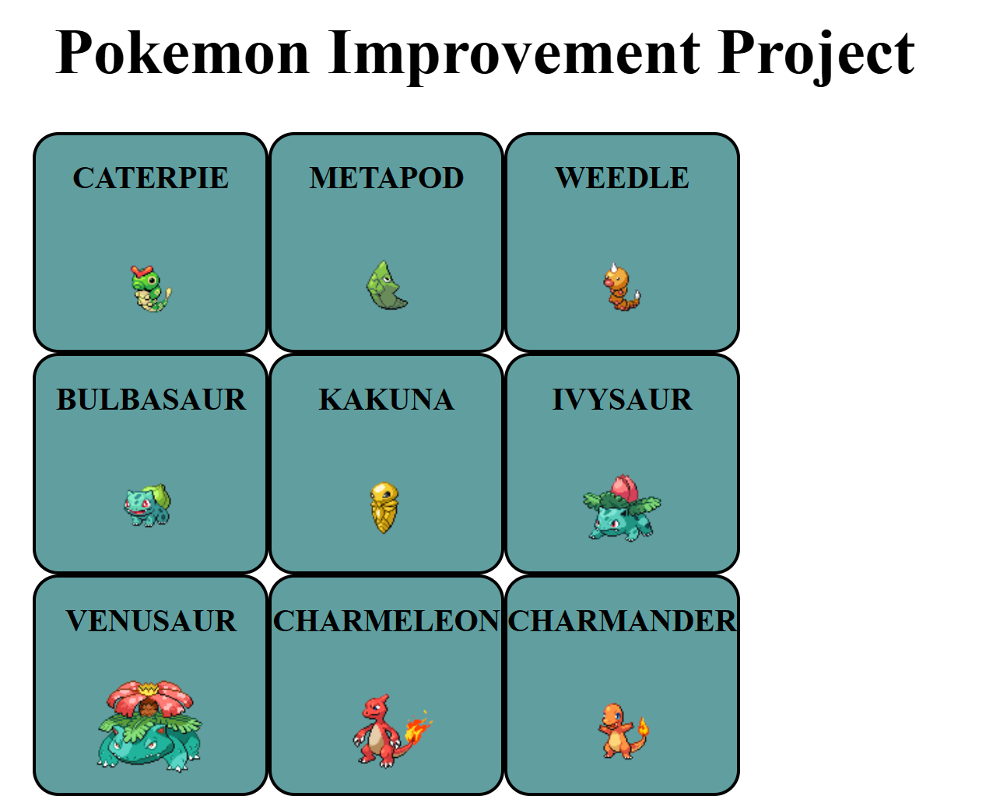
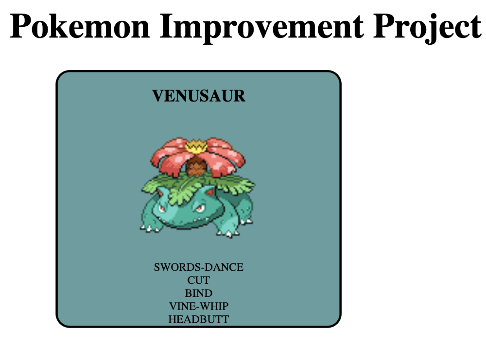

###### FORK AND CLONE THIS REPOSITORY TO YOUR GITHUB ACCOUNT

## Pokemon Improvement Project

Below you will be given requirements needed to create a copycat of a basic pokemon application. You will are provided with images to use as references that you will be expected to mirror as closely as possible. 

#### Home Page
In this project you will be utilizing the PokeApi, to create an application using your new knowledge of HTML,JavaScript, and CSS. You have been given all of the tools needed to successfully recreate an copycat application of the images below. 

You will need a minimum of 3 files (html, js, css). You may create more than the initial 3, you are only required to have the initial 3. 

Your home page will display 18 pokemon,similar to the image below. Using the images below as a reference, do your best to match the styling as closely as possible. Each card is required to display the name and image of each pokemon, have a background color different from your overall background color, and have an image with a height and width of 100px by 100px. And lastly each card must have a solid 3px black border with rounded corners. The overall pokemon card display needs to be centered rather than offset to one side or the other. 

The over all display of all 18 cards needs to be set to 3 cards wide and 6 cards tall. Above the displayed cards create your title inside the largest heading HTML uses.The title you create will be 'Pokemon Improvement Project'. This title must be centered on the page as well. 

### Minimal style requirements:
* solid border for each card
* border edge must be rounded
* infill color (you pick a color)
* names in all caps at top of card
* image no larger than 100px X 100px
* only 3 cards per row

### Just a few fundamentals you may want to use in creating your Home Page:
* fetch (likely more than 1)
* functions
* html elements
* CSS styling
* innerHtml()
* event handlers

 

 

#### Individual Pokemon Card
When you click on any of the cards your browser should now display a single pokemon (see image below). This card should have the same styling as the cards in the home page list, all caps name at the top followed by the image of the pokemon (400px X 400px), and then the first 5 moves that pokemon can execute. Lastly the card needs to be centered on the page. Just like the home page display the card should not be more to one side or the other.

 

 

Note: All of the foundational knowledge you need to create this application can be found in your Learn content.

Note: All pokeapi documentation is available at `https://pokeapi.co/`.
